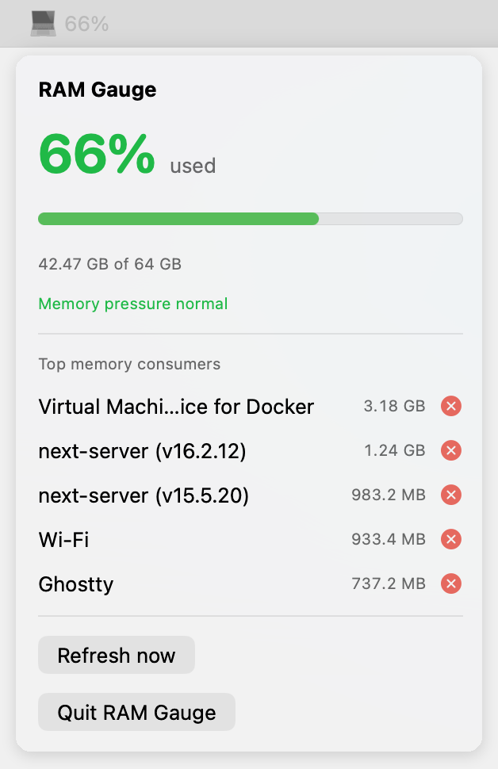

# RAM Gauge

A minimal macOS menu-bar app that shows used memory as a percentage of installed RAM.




## Install with AI

Paste this into Claude (or any AI agent on your Mac):

```text
Install RAM Gauge for me: download https://github.com/dawsbot/ram-gauge/releases/latest/download/RAMGauge-macos.zip, unzip it, move RAMGauge.app into /Applications, open it, and confirm the 💻 percentage appears in my menu bar.
```

## What it does

- Shows a live **RAM-used percentage** in the macOS menu bar.
- Uses green, yellow, and red status coloring.
- Refreshes every **5 seconds**, a good balance between freshness and negligible overhead.
- Opens a small details panel when clicked: used RAM, total RAM, progress bar, and status.
- Lists the top five memory consumers with readable names (Next.js dev servers show their project folder) and a kill button for each.
- Runs as a menu-bar-only app, with no Dock icon.

The color system considers both memory use and actual macOS memory-pressure events:

| Status | Meaning |
|---|---|
| Green | Normal memory use and no pressure warning |
| Yellow | Elevated usage, or macOS warning pressure |
| Red | Very high usage, or macOS critical pressure |

## Install manually

1. Download `RAMGauge-macos.zip` from **Releases**.
2. Double-click the ZIP, then drag `RAMGauge.app` into `/Applications`.
3. Open the app. Its percentage appears in the right side of the menu bar.

Releases are signed with a Developer ID certificate and notarized by Apple, so macOS opens them with no warnings.

## Build from source

Requirements: macOS 15 or newer and Xcode 16 or newer.

```zsh
git clone git@github.com:dawsbot/ram-gauge.git
cd ram-gauge
./scripts/install.sh
```

`install.sh` builds the app, copies it to `/Applications/RAMGauge.app`, and launches it.

## Development

```zsh
swift test
./scripts/build-app.sh
open dist/RAMGauge.app
```

The packaged output is:

```text
dist/RAMGauge.app
dist/RAMGauge-macos.zip
```

## Notes on the percentage

macOS intentionally uses free RAM for caching. RAM Gauge therefore treats the percentage as a compact capacity signal, while the yellow/red state also respects actual macOS memory-pressure warnings. That avoids calling normal caching behavior a danger state.
